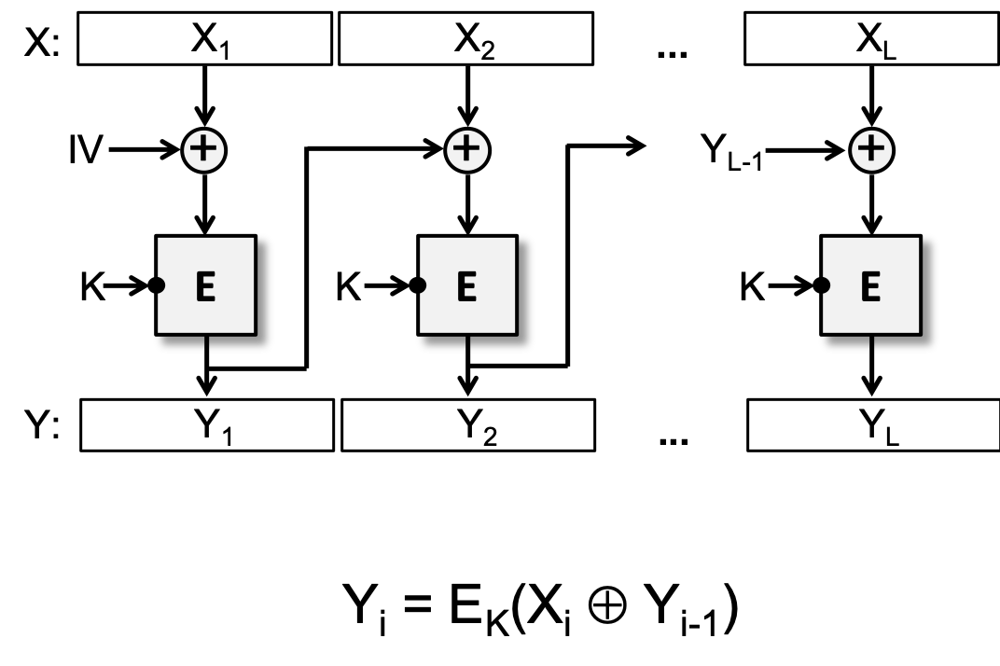
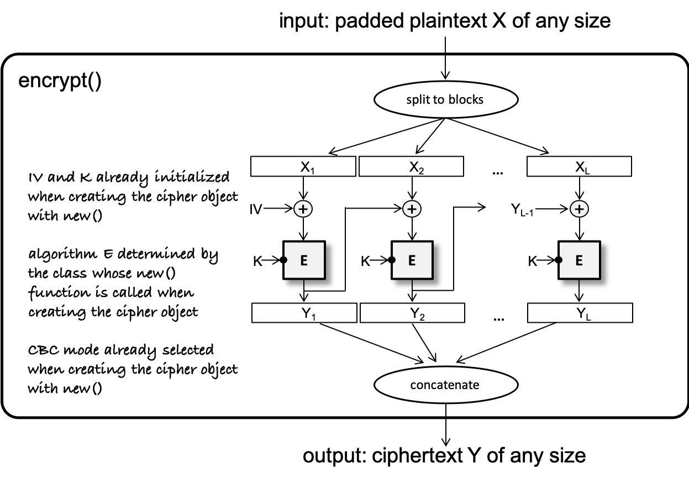
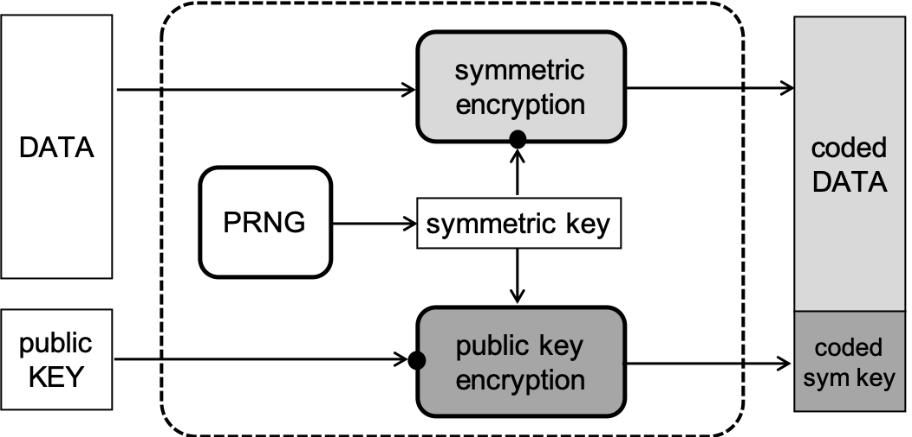

# IT Security  
## CRYPTO Lab

## Educational objectives  

In this lab exercise, you will use a real-world cryptographic program library for implementing simple command line tools that perform cryptographic operations. The goal of the exercise is to gain some hands-on experience with using a cryptographic library and to observe how some of the cryptographic primitives introduced during the lectures can be used in an application. More specifically, in this exercise, you will use the [PyCryptodome](https://github.com/Legrandin/pycryptodome/) cryptographic library to write Python applications that use the symmetric key block cipher AES in CBC mode as well the asymmetric key cipher RSA-OAEP and the digital signature scheme RSA-PSS. Moreover, the SHA-256 hash function and the PBKDF2 password based key derivation function will also be used. While you will not use all the primitives available in PyCryptodome, it is expected that you get the basic idea of how to use the PyCryptodome library and its documentation, and you will be capable of using also the primitives not covered in this exercise after reading the docs. In addition, as cryptographic libraries tend to be rather similar in terms of their abstractions, you are also expected to be capable of understanding and using other cryptographic libraries as well after accomplishing this exercise. 

## Background material  

### On cryptographic primitives

Cryptographic primitives are algorithms that can be used to implement security services such as providing confidentiality and integrity protection for data. The basic primitives are the following: symmetric and asymmetric key ciphers, hash functions, message authentication codes (aka MAC functions), and digital signature schemes. In this exercise, we will use a symmetric key block cipher (AES-CBC), an asymmetric key cipher (RSA-OAEP), a hash function (SHA-256), a MAC function based key derivation function (PBKDF2), and a digital signature scheme (RSA-PSS). 

*Block ciphers*, like AES, operate on a block of bits. They take an input block and produce an output block. The input and the output have the same size, which is called the block size of the cipher. For instance, the AES block size is 128 bits (or 16 bytes), which means that AES processes 128-bit (or 16-byte) blocks. Block ciphers have another input, the *key*, which is a vector of random bits. In case of AES, the key size (length of the vector) is variable, and it can be 128, 192, or 256 bits (or 16, 24, or 32 bytes).

As the plaintext to be encrypted is usually longer than the length of a single block, we need methods to use the block cipher to encrypt and decrypt such long inputs. These methods are called *block encryption modes*, and there exist a few standardized modes. In this exercise, we will use the Cipher Block Chaining (CBC) mode, the operation (encryption part) of which is illustrated in the following figure.

As you can see, the input is divided into blocks which are processed in the way shown in the figure. In order to process the first block, we need an *Initial Vector* (or IV), which must be an unpredictable random block. It is usually generated with the help of a cryptographic random number generator. In addition, as the same IV is needed for decryption, it must be made available to the receiver of the ciphertext. Usually, it is prepended to the ciphertext (sometimes in an encrypted form, where the encryption uses the same key as the encryption of the plaintext).

We must also deal with the problem that the length of the plaintext may not be a multiple of the block length. To address this issue, we use *padding* before encryption. There are standardized padding schemes, such as the PKCS7 padding, that add extra bytes to the end of the plaintext to make its length a multiple of the block length. In practice, the plaintext is always padded before it is encrypted. At the receiver side, this padding must be removed after decryption.

Note that cryptographic libraries often do not hide the generation of the IV and the padding of the plaintext behind abstractions, which means that the programmer has to deal with them. In such cases, the programmer is responsible for generating a random IV with a cryptographic random number generator, and for padding the plaintext using some chosen padding scheme. The block cipher is then initialized with a key, the block encryption mode (e.g., CBC) to be used, and the generated IV. Once initialized, the padded plaintext can be passed to the encryption function, which takes care of splitting it into blocks, computing the ciphertext blocks, and joining the computed blocks to get the ciphertext. The figure below illustrates what happens behind the scenes hidden from the programmer during CBC mode encryption. Then, the programmer must prepend the IV to the ciphertext. On the receiving side, these operations are performed in the reverse order to recover the original plaintext. 

Encryption keys should never be hard coded in programs, otherwise someone having access to the program (source code or even binary) would be able to find that hard coded key by reverse engineering the program. Rather, keys are generated on-the-fly by the program itself or loaded from external sources. Often keys are generated from passphrases that are requested by the program from the user as an input. Generating keys from passphrases has its own problems, so one must do this carefully. Typically, a secure *password-based key derivation function* should be used for this purpose, instead of using some ad hoc derivation method (such as simply hashing the passphrase with a hash function). A well known password-based key derivation function is PBKDF2.

In case of symmetric key ciphers, like AES, the same key is used for encryption and decryption. There exist *asymmetric key ciphers* as well, like RSA, where the encryption and the decryption keys are not the same. In case of asymmetric key ciphers, the encryption and decryption keys form a *key pair*, and they are generated together using a key pair generation algorithm. The encryption key is then made public, and it is often called the *public key*, while the decryption key is kept secret, and it is often called the *private key*. Otherwise, in practice, asymmetric key ciphers are similar to block ciphers in the sense that they can encrypt a long input (several hundreds or thousands of bits) at once.

Asymmetric key ciphers are orders of magnitude slower than symmetric key ciphers. For this reason, we usually do not use them to encrypt very long messages. Rather we use hybrid encryption, which means that we first encrypt the long message with a symmetric key cipher (e.g., AES in CBC mode) using a randomly generated key, and then we encrypt only the randomly generated key with the asymmetric key cipher (e.g., RSA) using the public key of the intended receiver. The sender then concatenates the encrypted message and the encrypted message encryption key, and sends them together to the receiver. This is illustrated in the figure below. The receiver first recovers the message encryption key by decrypting the encrypted key with the asymmetric key cipher using the receiver's private key, and then uses the so recovered key to decrypt the message with the symmetric key cipher.

A *digital signature scheme* is an asymmetric key primitive that can be used to protect the integrity of the message and provably authenticate its origin. Digital signature schemes also use key pairs, but in this case, the sender uses his private key to sign, and the receiver uses the sender's public key to verify the signature. A signature typically looks like a checksum that is computed with the signature generation function from the message to be signed and the private key of the signer, and then appended to the message. The verifier takes the signature and the message, and uses the signature verification function with the public key of the signer to verify the signature. 

Digital signature scheme are also slow, similar to asymmetric key ciphers. So in practice, we do not sign a long message directly, but rather we compute a hash of the message first, and we sign only the hash. It is important to use a cryptographically strong, *collision resistant* hash function for this purpose, like SHA-256.

Key pairs or their individual elements are often stored in files. In this case, it is very important to store the private key in an encrypted form, as otherwise anyone having access to the key file would be able to read the private key which should remain secret. Most cryptographic libraries provide functions that support key pair management. These functions allow for exporting the key pair or its elements in standardized formats (like PEM or DER) and under passphrase protection, which means that the exported private key is stored in an encrypted form in the file, where the encryption key is derived securely from a user supplied passphrase.

### On PyCryptodome

PyCryptodome is a Python module that implements cryptographic primitives and many useful utilities, such as padding schemes and key export/import functions. It can be easily installed with the `pip` command:

`pip install pycryptodome`

In PyCryptodome, cryptographic primitives, like ciphers and hash functions, are represented as objects, which have attributes and functions (or methods). So typically, the programmer has to create an instance of the desired primitive with the `new()` function (e.g., `cipher = AES.new(...)`) and then (s)he can access its parameters as the attributes of the object and call its functions (e.g., `cipher.encrypt(...)`). The `new()` function can take input arguments that are used to initialize the primitive (e.g., `cipher = AES.new(key, AES.MODE_CBC, iv)`). 

The best way to get familiar with PyCryptodome is to read its [API documentation](https://pycryptodome.readthedocs.io/en/latest/src/api.html) and to start trying the provided examples thereof. For this lab exercise, it is strongly recommended to read the following parts of PyCryptodome's API documentation:

- [AES block cipher](https://pycryptodome.readthedocs.io/en/latest/src/cipher/aes.html)
- [CBC mode](https://pycryptodome.readthedocs.io/en/latest/src/cipher/classic.html#cbc-mode)
- [Random generation](https://pycryptodome.readthedocs.io/en/latest/src/random/random.html)
- [Padding schemes](https://pycryptodome.readthedocs.io/en/latest/src/util/util.html#crypto-util-padding-module)
- [PBKDF2 key derivation function](https://pycryptodome.readthedocs.io/en/latest/src/protocol/kdf.html#Crypto.Protocol.KDF.PBKDF2)
- [SHA-256 hash function](https://pycryptodome.readthedocs.io/en/latest/src/hash/sha256.html)
- [RSA key pair generation](https://pycryptodome.readthedocs.io/en/latest/src/public_key/rsa.html)
- [RSA-OAEP cipher](https://pycryptodome.readthedocs.io/en/latest/src/cipher/oaep.html)
- [RSA-PSS digital signature](https://pycryptodome.readthedocs.io/en/latest/src/signature/pkcs1_pss.html)

## Setting up the environment  

### Using the provided Virtual Machine  
Using the VirtualBox application, import the released OVA file and start the VM. No further preparation is required using the provided VM.

### Using your local environment  

If you are not using the provided VM, follow the included Python tutorial to set up the virtual environment. Then, install and verify the following dependencies:
- Python 3.7 or later (installed system-wide)
- pycryptodome 3.18.0 (installed within the virtual environment)

### Downlaoding the initial code base

Download or git clone the provided code skeletons and test files from here: [https://software.crysys.hu/it-security/cryptography](https://software.crysys.hu/it-security/cryptography)

## Challenges to solve  

This lab exercise consists of 4 challenges. The first two challenges involve using the AES block cipher in CBC mode for encryption and decryption. The second two challenges deal with hybrid encryption and decryption and digital signature generation and verification, and in addition to AES, the RSA-OAEP and RSA-PSS algorithms must be used to solve them. In each challenge, you have to complete a Python program that we have started to write, but didn't finish, to obtain a working application. The incomplete programs include the handling of command line arguments, contain some useful additional functions, many useful comments, and include some of the main functionality to be implemented. Missing parts are marked with underscore characters (`___`) or dot characters (`...`). Underscores indicate a missing element (e.g. a missing function parameter or function name), while dots indicate several missing elements (e.g. a missing program line or major program detail). For the time being, the parts that need to be completed are placed in comments, which are labelled with `# TODO:`. In the solution, the `# TODO:` tag should be removed from these parts and the program should be completed appropriately.

### Challenge 1

In Challenges 1 and 2, you need to write a Python program that uses the AES cipher in CBC mode to encrypt and decrypt files. The following files are provided for these challenges:

- `_aes_cbc.py` -- the incomplete program skeleton to be completed,
- `test_plaintext_1.txt` -- a test input file for Challenge 1,
- `test_ciphertext_2.crypted` -- a test input file for Challenge 2.

The program receives the following command line inputs:

- an indication of the operation to be performed (e = encryption or d = decryption),
- a password from which to generate (derive) the AES key,
- the name of the input file containing the data to be encrypted or decrypted,
- the name of the output file where the result of the encryption or decryption is written. 

In short, the program should do the following: read the contents of the input file, encrypt or decrypt (depending on the operation specified on the command line) the contents using the AES cipher in CBC mode with the key generated from the given password, and then write the result to the output file.

In Challenge 1, you have to complete the encryption part of the program. It is recommended to make a copy of the file `_aes_cbc.py`, rename it to `aes_cbc.py`, and work on this copy (so that the original incomplete program is preserved and available in case you need to re-start from scratch).

First, inspect the incomplete program and try to understand what kind of command line input the program expects, and how it processes that input. Then look at the encryption part, read the comments, and add the appropriate function names and parameters to the program.

When the encryption part is completely finished, put the program into TEST mode by setting the `TEST` variable to `True` and run the program with the encryption switch (`-e` in the command line) with the test input file `test_plaintext_1.txt` using the password *adishamir*. The program prints the last 16 bytes of the resulting ciphertext in hex format. This is what you must submit as the solution to Challenge 1.

### Challenge 2

In Challenge 2, you must complete the decryption part of `aes_cbc.py` by following the instructions given in the comments. When the decryption part is completely finished, run the program with the decryption switch (`-d` in the command line) with test input file `test_ciphertext_2.crypted` using the password *ronrivest*. The program prints the first 16 bytes of the resultiong plaintext in hex format. This is what you must submit as the solution to Challenge 2.

### Challenge 3

In Challenges 3 and 4, you need to develop a Python program that uses hybrid encryption and decryption, and optionally generates and verifies digital signatures. To implement the above functions, the program uses the AES-CBC, RSA-OAEP, and RSA-PSS algorithms. The following files are provided for these challenges:

- `_hybrid.py` -- the incomplete program skeleton to be completed,
- `test_plaintext_3.txt` -- a test input file for Challenge 3,
- `test_ciphertext_4.txt` -- a test input file for Challenge 4,
- `test_pubkey.pem` -- a PEM file containing a test public key,
- `test_keypair.pem` -- a PEM file containing a test key pair; since the key pair contains the private key, it is password protected (and the password is *crysys*).

The program receives the following command line inputs:

- an indication of the operation to be performed (k = key pair generation, e = encryption, or d = decryption),
- the name of the input file containing the data to be encrypted or decrypted,
- the name of the output file in which the result of the encryption or decryption is written,
- the name of the PEM file containing the public key needed for encryption (or digital signature verification),
- the name of the PEM file containing the private key (i.e. the key pair containing it) needed for decryption (or digital signature generation).

In short, the program should work as follows: the program reads the contents of the input file and the key files and performs the requested operation (encryption or decryption) on the input. Hybrid cryptography is used, i.e. the input is encrypted with a randomly generated symmetric key using AES in CBC mode, and then the symmetric key is encrypted with the given public key using the RSA-OAEP algorithm. For decryption, the symmetric key is first decrypted using RSA-OAEP with the specified private key, and then the input is decrypted using AES with the resulting symmetric key in CBC mode. We want to output the result of the encryption process in json format to the output file, where the value part of the key-value pairs is encoded using Base64 encoding. If there was a private key file among the command line inputs when doing encryption, then the program must also create a digital signature and include it in the json structure. In the case of decryption, if the json structure in the input file contains a digital signature, then the command line inputs must include a file containing a public key, and the digital signature must be verified against this public key before the full decryption. 

In Challenge 3, the encryption part of the incomplete program must be completed. It is recommended to make a copy of the file `_hybrid.py` and rename it to `hybrid.py`, and work on this copy (this way the original incomplete file is preserved and available in case you need to re-start from scratch). 

First, inspect the given incomplete program: what command line input is it expecting and how does it process it? Examine also the helper functions at the beginning of the program file, which save and load keys. It is also worth examining the key pair generation function and understanding how it works. Once you have familiarised yourself with the structure of the program and the operation of the given parts, you can start writing the missing parts. Follow the instructions and advice given in the comments.  

When the encryption part is completely finished, put the program into TEST mode by setting the `TEST` variable to `True` and run the program with the encryption switch (`-e` in the command line) with the test input file `test_plaintext_3.txt` and the test public key `test_pubkey.pem`. The program will print 32 characters to the screen, and this is what you must submit as the solution to Challenge 3. 

As part of the exercise, examine the contents of the output file generated by the program. Since the results of all crypto operations are written in Base64 encoding into the output json structure, the file contains ASCII characters and can be read by any text editor or printed to the screen using either the `less` or `cat` commands. You can clearly see how the different output elements (i.e. the encrypted AES key, the IV used by the CBC mode, the encrypted content itself, and the digital signature) are written in the file.

### Challenge 4

In Challenge 4, you have to complete the decryption part of the program following the advice and instructions given in the comments. In this challenge, there are already complete missing lines (marked `...`) that need to be written. When the decyrption part is finished, run the program in decryption mode (`-d` in the command line) with the input file `test_ciphertext_4.txt` and the file `test_keypair.pem` containing the private key (reminder: the private key is protected by the password *crysys*, which must be entered on the keyboard when prompted by the program). The program will print the last 16 bytes of the resulting plaintext in hex format. This is what you must submit as the solution to Challenge 4.

